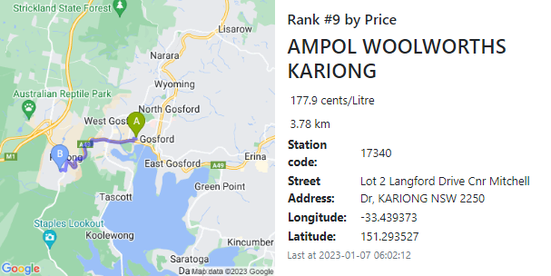

# Fuel Seeker NSW

## Description

Fuel Seeker is an application that allows users to search for Fuel Nearby to their location. Users can search by Fuel Type, Price and Distance.
The projct uses two Third Party API's.
 - NSW Fuel API - a governement API which is used to get the Nearby Fuel Prices across NSW.
 - Google Maps Javascript API - used to display both Interactive and Static Maps that show the location of Fuel Stations and directions from the Users location. 

 This app was developed as finding cheap fuel is important to alot of people and there was few other options out there, and they did not have all of the features we have included. 


## User Story

```
AS A motorist
I WANT to search for Fuel Nearby
SO THAT I can find the cheapest or closest fuel to my current location
```

## Acceptance Criteria

```
GIVEN I want to search the API for Fuel nearby
WHEN I open the browser
THEN I am prompted to allow my location permissions
WHEN I block the request for location
THEN I am prompted with a modal that includes a link on how to enable location.
WHEN I select the Fuel Type, Radius and Sort by Distance options
THEN I am returned a maximum of 10 Fuel Stations ranked by Distance
WHEN I select the Fuel Type, Radius and Sort by Price Options
THEN I am returned a maximum of 10 Fuel Stations ranked by Price
WHEN I dont select Fuel Type, Radius and Sort by options
THEN I am prompted with a modal that tells me missing selections
WHEN I select Find Station button
THEN I am presented with a map that shows the 10 stations with a marker within the chosen radius, I am also presented with detailed results cards for each staion, including mao directions visualised
WHEN I select find again button
THEN I am returned to the landing page.
WHEN I select auto fill based on last search button
THEN the input fields are auto-filled based on my last search
WHEN I select reset button
THEN the input fields are cleared
```


## Technology
- HTML
- CSS
- Javascript
- Bootstrap

- Fontawesome - https://fontawesome.com/
- Google fonts - https://developers.google.com/fonts

### APIs
- NSW Fuel API
- Google Maps Javascript API
- Geolocation

## Usage

The user will be promoted to allow their geolocation to be read when they open their browser to the Landing page. Once confirmed the user can select their Input Parameters and click Find Staion to return results. 


The results are returned showing a Large Google Map with the Users location and all of the Fuel Markers places on the Map.





## Credits

- Peter Cao - https://github.com/ptrcao, 
- Joana Villajuan - https://github.com/joanavillajuan
- Dylan Stroud - https://github.com/Dylan-Stroud
- Sarah Mullock - https://github.com/smullock


